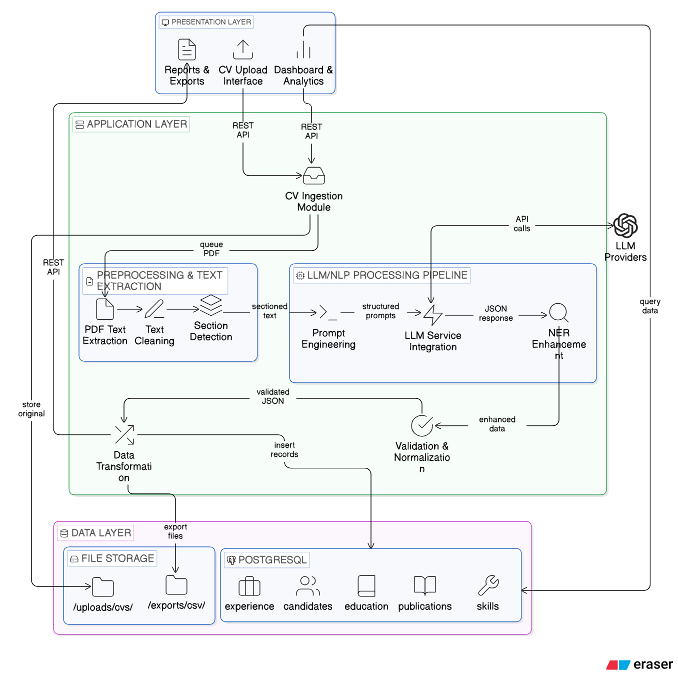
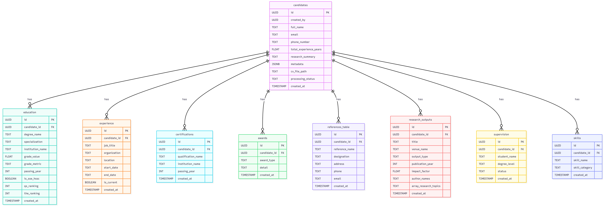

````markdown
# 🔍 TALASH: Talent Acquisition & Learning Automation for Smart Hiring
*An Intelligent CV Parsing and Talent Acquisition System powered by Google Gemini*

<p align="center">
  <a href="https://www.python.org/"></a>
  <a href="https://ai.google.dev/"></a>
  <a href="https://supabase.com/"></a>
  <a href="https://www.kaggle.com/"></a>
</p>

---

**Course:** CS 417 - Large Language Models (Spring 2026)  
**University:** NUST Islamabad  
**Instructor:** Prof. Dr. Muhammad Moazam Fraz  
**Team Member (Milestone 1):** Nameer Ahmed - 454029 · Rimsha Mahmood - 455080 · Muhammad Ahmed Riaz - 461348  
**Repository:** [https://github.com/mahmadr10/Talash-LLM_Project](https://github.com/mahmadr10/Talash-LLM_Project)

---

## 📋 Table of Contents

1. [Project Overview](#-project-overview)  
2. [System Architecture](#-system-architecture)  
3. [Database Schema](#-database-schema)  
4. [LLM Integration Strategy](#-llm-integration-strategy)  
5. [Setup & Installation](#-setup--installation)  
6. [Sample Output](#-sample-output-anonymized)  
7. [Submission Deliverables](#-submission-deliverables)  

---

## 🎯 Project Overview

TALASH is a **next-generation recruitment pipeline** designed for complex academic hiring workflows.  

**Milestone 1** focuses on replacing manual CV data entry with an **autonomous, LLM-driven extraction and normalization pipeline**.

### 🚀 Core Capabilities

- **📄 Robust PDF Ingestion**  
  Extracts structured text from dense, multi-page academic CVs.

- **🧠 Autonomous Structuring**  
  Uses Google Gemini to convert raw text into structured JSON.

- **🧹 Data Cleaning & Normalization**  
  Handles GPA extraction, string normalization, and enum standardization.

- **🗄️ Relational Storage**  
  Stores parsed data across a **9-table PostgreSQL schema**.

---

## 🏗️ System Architecture

Pipeline Flow:

> **PDF → Text Extraction → Prompt Engineering → Gemini → JSON Validation → Database Insertion**

<p align="center">
  
</p>

---

## 💾 Database Schema

TALASH uses a **Hub-and-Spoke relational database model** for scalable querying and analytics.

<p align="center">
  
</p>

### 🧩 Highlights

- **JSONB Extensibility** → Flexible metadata storage  
- **🔐 Row-Level Security (RLS)** → Protects candidate data  
- **⚡ Indexed Foreign Keys** → Fast joins and queries  

````

2. Add secrets:

   * GEMINI_API_KEY
   * SUPABASE_URL
   * SUPABASE_SERVICE_ROLE_KEY

3. Upload CVs to `/kaggle/input/`

4. Run all cells

---

### Option B: Local Setup

1. Clone repo:

   ```bash
   git clone https://github.com/mahmadr10/Talash-LLM_Project.git
   cd Talash-LLM_Project/milestone_1
   ```

2. Setup environment:

   ```bash
   python -m venv venv
   ```

   Windows:

   ```bash
   venv\Scripts\activate
   ```

   macOS/Linux:

   ```bash
   source venv/bin/activate
   ```

3. Install dependencies:

   ```bash
   pip install -r requirements.txt
   ```

4. Create `.env`:

   ```env
   GEMINI_API_KEY=your_api_key
   SUPABASE_URL=your_url
   SUPABASE_SERVICE_ROLE_KEY=your_key
   ```

5. Add CVs → `input_cvs/`

6. Run:

   ```bash
   python main.py
   ```

---

## 📊 Sample Output (Anonymized)

*Note: Due to strict data privacy and PII protection policies, the raw academic CV datasets and full CSV exports are not included.*

---

### 📄 1. Raw PDF Input (Mock Example)

```
Dr. Jane Doe | jane.doe@email.com | +92-300-0000000  
Education: PhD in Computer Science, FAST NUCES (2020) - CGPA: 3.9/4.0  
Experience: Assistant Professor at NUST (2021-Present)
```

---

### 🧠 2. Extracted JSON (Gemini Output)

```json
{
  "personal_info": {
    "full_name": "Jane Doe",
    "email": "jane.doe@email.com",
    "phone_number": "+92-300-0000000",
    "total_experience_years": 5.0,
    "research_summary": "Focused on Artificial Intelligence and Large Language Models.",
    "metadata": {
      "date_of_birth": "1990-01-01",
      "linkedin": "https://linkedin.com/in/janedoe"
    }
  },
  "education": [
    {
      "degree_name": "PhD",
      "specialization": "Computer Science",
      "institution_name": "FAST NUCES",
      "passing_year": 2020,
      "grade_value": 3.9,
      "grade_metric": "GPA",
      "is_sse_hssc": false
    }
  ],
  "experience": [
    {
      "job_title": "Assistant Professor",
      "organization": "NUST",
      "location": "Islamabad, Pakistan",
      "start_date": "2021",
      "end_date": "Present",
      "is_current": true
    }
  ],
  "certifications": [
    {
      "qualification_name": "Deep Learning Specialization",
      "institution_name": "Coursera",
      "passing_year": 2021
    }
  ],
  "awards": [
    {
      "award_type": "Best Paper Award",
      "detail": "IEEE International Conference on AI, 2022"
    }
  ],
  "references_table": [
    {
      "reference_name": "Dr. John Smith",
      "designation": "Professor",
      "address": "FAST NUCES, Islamabad",
      "phone": "+92-333-1111111",
      "email": "john.smith@email.com"
    }
  ],
  "research_outputs": [
    {
      "title": "Optimizing Transformers for Low-Resource Languages",
      "venue_name": "ACL Proceedings",
      "output_type": "Conference",
      "publication_year": 2023,
      "impact_factor": null,
      "author_names": "Jane Doe, John Smith",
      "research_topics": ["NLP", "Transformers", "LLMs"]
    }
  ],
  "supervision": [
    {
      "student_name": "Ali Khan",
      "degree_level": "MS",
      "status": "Completed"
    }
  ],
  "skills": [
    {
      "skill_name": "Python",
      "skill_category": "Technical"
    },
    {
      "skill_name": "PyTorch",
      "skill_category": "Tool"
    }
  ]
}
```

---

## 🌟 Future Work

* 📊 Candidate ranking system
* 🎯 Job matching engine
* 📈 HR analytics dashboard
* 🤖 Fine-tuned LLM


